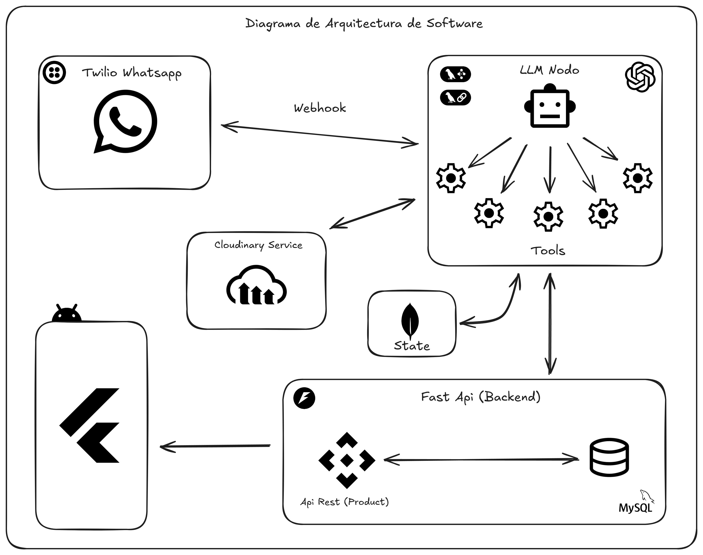

# Gestión de Productos con Agente de IA y WhatsApp

Este proyecto integra un **agente de Inteligencia Artificial** para la gestión de productos, comunicación vía WhatsApp y visualización en aplicación móvil Flutter.

## Descripción

El sistema permite:
- Crear y actualizar productos vía WhatsApp.
- Generar descripciones llamativas basadas en el nombre del producto.
- Generar imágenes de productos y enviarlas a **Cloudinary**; las URLs se almacenan en la base de datos.
- Consultar productos, precios, stock y comparaciones.

## Arquitectura

### Backend
- **Framework:** FastAPI
- Gestiona el modelo de productos y la comunicación con el agente de IA.
- **Base de datos:** MySQL y MongoDB (para productos y estado de conversaciones).

### Frontend
- **Framework:** Flutter
- Visualiza productos, descripciones e imágenes.

### Agente de IA
- **Tecnologías:** LangGraph, LangChain
- **Comunicación:** Twilio WhatsApp
- Funcionalidades:
  - Crear/actualizar productos.
  - Generar descripciones e imágenes.
  - Consultar stock y precios.
  - Mantener conversaciones activas con MongoDB.

## Flujo del Sistema

1. El usuario interactúa con el agente vía WhatsApp.
2. El agente procesa la solicitud con LangGraph y LangChain.
3. Para creación/actualización:
   - Genera descripciones e imágenes.
   - Almacena imágenes en Cloudinary.
   - Actualiza la base de datos de productos.
4. Para consultas:
   - Devuelve información sobre productos, precios y stock.
5. El frontend Flutter consume la API para mostrar productos y detalles.

## Tecnologías

- **Backend:** FastAPI  
- **Frontend:** Flutter  
- **Base de datos:** MongoDB + MySQL 
- **Agente de IA:** LangGraph, LangChain  
- **Comunicación:** Twilio WhatsApp  
- **Almacenamiento de imágenes:** Cloudinary

